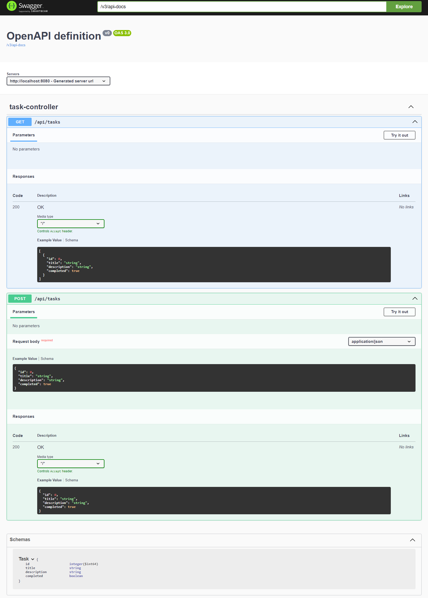

# Task Manager API (Spring Boot Project)


Welcome! 🌟

This is an **open-source Java project** designed to provide a fully functional **Task Manager REST API** built with **Spring Boot**.
It serves both as a professional project example and as a real, live repository for the community.

---

## 🌟 Features

- ✅ **CRUD operations** for tasks (Create, Read, Update, Delete)
- ✅ **DTO mapping** for clean architecture
- ✅ **Service - Repository layered structure**
- ✅ **Swagger/OpenAPI documentation** for easy testing
- ✅ **Friendly and clear code style**, ready for extension
- ✅ **Modern Java 21 features** utilized

---

## 📊 Technologies Used

- Java 21 ☕
- Spring Boot 3+
- Spring Web
- Spring Data JPA
- H2 Database (for development and testing)
- Lombok
- Swagger (Springdoc OpenAPI)
- Maven

---

## 📚 Project Structure

```text
src/
 ├── main/
 │   ├── java/com/example/taskmanager/
 │   │   ├── controller/
 │   │   ├── service/
 │   │   ├── repository/
 │   │   ├── dto/
 │   │   └── model/
 │   └── resources/
 │       ├── application.properties
 │       └── static/
 └── test/
```

## 🧪 Testing

This project includes unit tests to ensure code stability and correctness.

Run all tests using:
```bash
./mvnw test

mvn test

---

## 🚀 Roadmap

- [x] Setup project structure
- [x] Implement CRUD operations
- [x] Setup Swagger documentation
- [ ] Add unit and integration tests
- [ ] Secure API with JWT authentication
- [ ] Create Dockerfile and docker-compose support
- [ ] Deploy to cloud

## 🤝 Community Support

We warmly welcome any contributions, ideas, or feedback!

Feel free to:
- Fork this repository
- Create issues
- Submit pull requests
- Suggest improvements

Together we make open-source better! 🚀

---

## 🚀 How to Install and Run the Project

### 1. Clone the Repository

```bash
git clone https://github.com/MattJavaDeveloper/task-manager-api-enterprise.git
cd task-manager-api-enterprise
```

### 2. Build and Launch the Project

```bash
./mvnw spring-boot:run
```

> ⚡ If you don't have Maven Wrapper installed, run: `mvn spring-boot:run`

### 3. Open the Application in Browser

Swagger UI for testing the API will be available at:

```bash
http://localhost:8080/swagger-ui/index.html
```
## Swagger UI Preview

Here is a quick look at the automatically generated API documentation:


---

## 🌟 Why This Project?

- Demonstrates clean **REST API** architecture
- Designed for **real-world** usage and portfolio enhancement
- Created with **passion for code quality** and open-source contribution
- Aims to **inspire and help developers** around the world

This project is not just "yet another tutorial app", but a professional-grade starting point for larger systems.

---

## 🌈 Contributions

Contributions, feedback, and improvements are **very welcome**!
Feel free to fork the project, make changes, and submit a pull request.
Let's grow the open-source community together! 💪

---

## 🔧 License

This project is open-source and available under the [MIT License](LICENSE).

---

## 💡 Final Notes

- Built with ❤️ by a passionate Java developer
- Always striving for code excellence
- Made for developers, by developers

---

> Let's create something awesome together! 🌟

